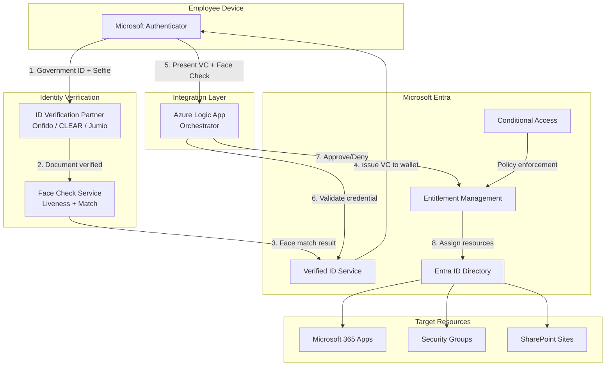
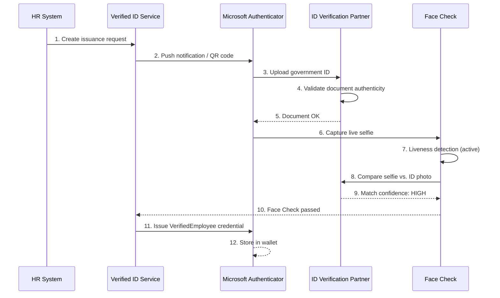
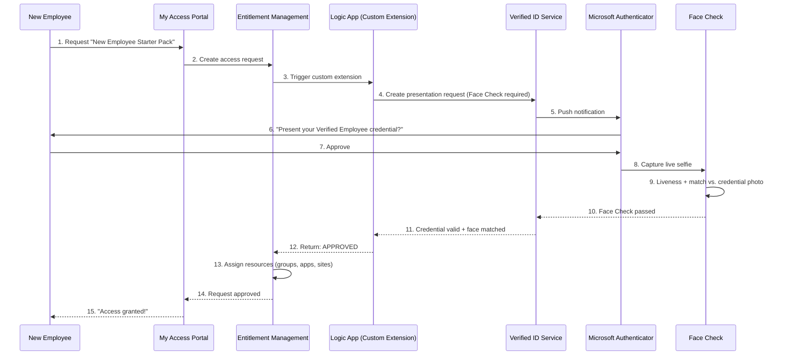
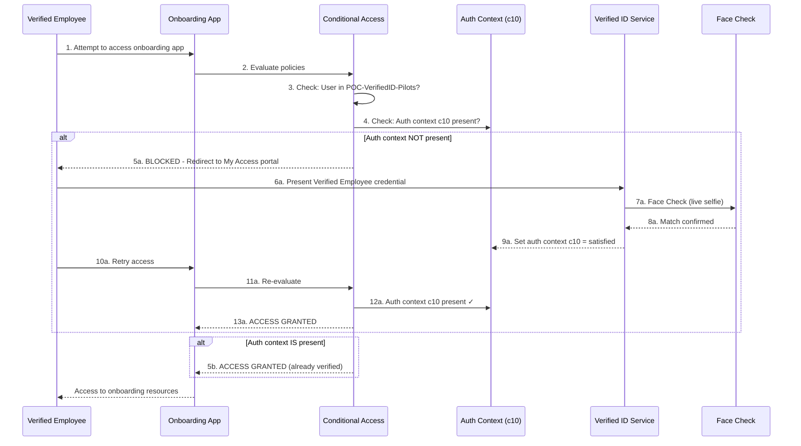
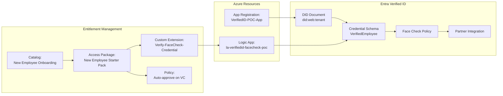
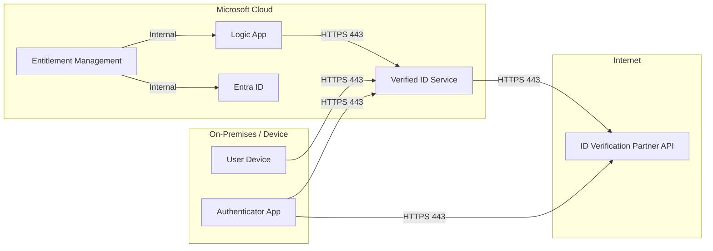

# Architecture: Verified ID + Face Check + Entitlement Management

## High-Level Architecture

## Issuance Flow (Credential Creation)

## Presentation + Access Request Flow

## Conditional Access Enforcement Flow

## Component Relationships

## Network and Data Flow

## Security Boundaries

| Layer | Protection |
|-------|-----------|
| Credential storage | Encrypted in Microsoft Authenticator, device-bound |
| Face Check | Live selfie never stored; processed in-memory only |
| Government ID | Processed by partner; not stored in Entra |
| Presentation | Zero-knowledge proof; verifier only sees required claims |
| Access assignment | Audit-logged; time-bound; revocable |
| Logic App | Managed identity authentication; no stored secrets |
